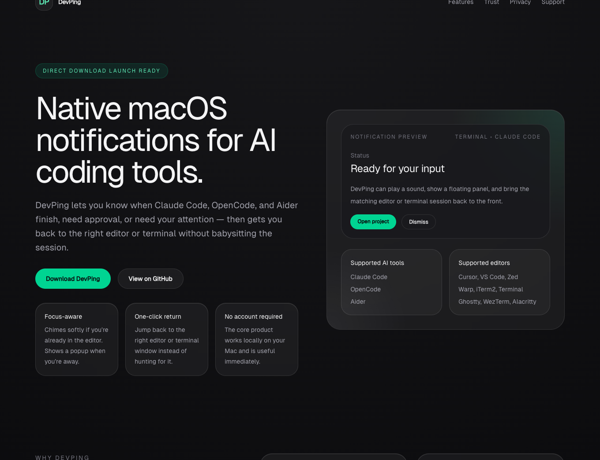
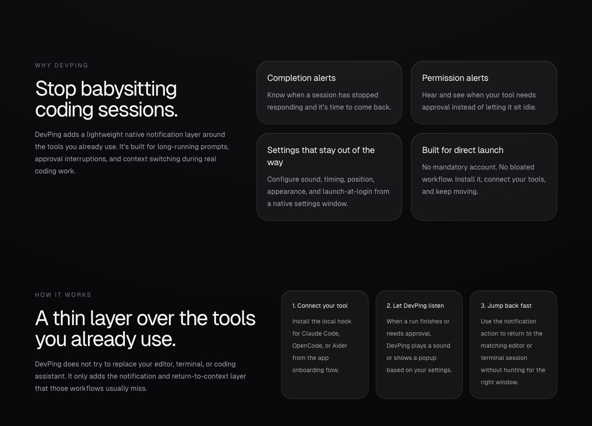
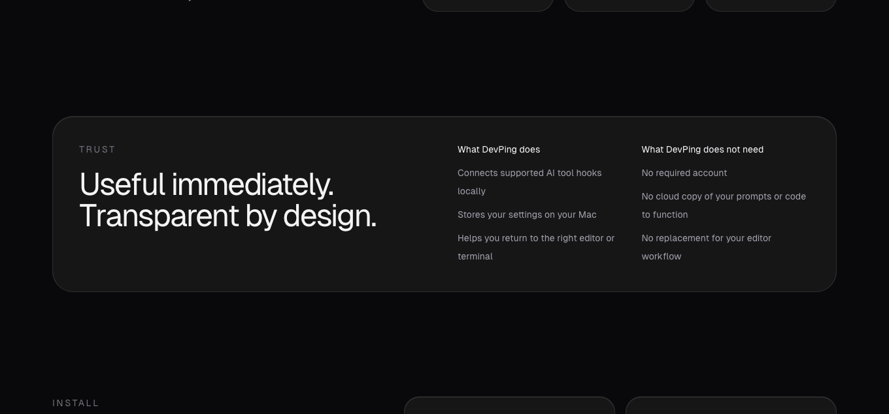

# DevPing

Native macOS notifications for AI coding tools.

DevPing is a lightweight menu bar app that plays a sound or shows a polished popup when your coding assistant finishes, needs approval, or needs your attention — then lets you jump back to the right editor or terminal window.

**Platform:** macOS 14+  
**Status:** Direct-download launch in progress  
**Current integrations:** Claude Code, OpenCode, Aider

---

## Why DevPing

AI coding sessions are easy to lose track of.

DevPing solves that by giving you:

- native macOS notifications for long-running coding sessions
- configurable sounds and popup behavior
- smart focus detection
- one-click return to the right editor or terminal window
- menu bar access for settings and test notifications

---

## Features

- **Smart focus detection** — only chimes when your editor is already focused, shows a popup when you’re away
- **Completion alerts** — know when a coding session has finished
- **Permission alerts** — hear and see when approval is needed
- **Settings UI** — configure sounds, timing, display, and appearance
- **Multiple macOS system sounds** — including Glass, Tink, Ping, Pop, and more
- **Smart editor detection** — works across popular code editors and terminals
- **One-click focus** — jump back to the correct app/window
- **Stacking notifications** — multiple panels stack cleanly
- **Auto-dismiss timer** — configurable from short alerts to persistent notifications
- **Menu bar mode** — lives quietly in the background until needed

---

## Supported tools

### AI tools

- Claude Code
- OpenCode
- Aider

### Supported editors / terminals

- Zed
- Cursor
- VS Code
- Windsurf
- Void
- Sublime Text
- Fleet
- Nova
- Warp
- iTerm2
- WezTerm
- Alacritty
- Ghostty
- Terminal.app

---

## Screenshots

### Website







### Mobile


## Install

### Homebrew (recommended)

```bash
brew tap vibe-marketer/devping
brew install devping
devping-setup
```

### Manual install

```bash
swift build -c release
mkdir -p ~/.local/bin
cp .build/release/devping ~/.local/bin/
chmod +x ~/.local/bin/devping
./bin/devping-setup
```

The setup script installs the DevPing hook and patches supported tool settings.

---

## Open settings

```bash
devping --settings
```

---

## How it works

1. Your AI tool fires a hook when it finishes or needs approval.
2. The DevPing hook detects the runtime and the active editor/terminal context.
3. DevPing checks whether your editor is already frontmost.
4. If you’re already in the editor, it can play a softer sound only.
5. If you’re away, it shows a floating notification panel and plays the configured sound.
6. Clicking the action button brings the correct app/window back to the front.

---

## Trust, privacy, and support docs

Before public launch, these docs should ship with the product:

- [`docs/PRIVACY.md`](docs/PRIVACY.md)
- [`docs/SUPPORT.md`](docs/SUPPORT.md)
- [`docs/PERMISSIONS.md`](docs/PERMISSIONS.md)
- [`docs/WHAT-DEVPING-CHANGES.md`](docs/WHAT-DEVPING-CHANGES.md)
- [`docs/UNINSTALL.md`](docs/UNINSTALL.md)
- [`docs/LAUNCH-CHECKLIST.md`](docs/LAUNCH-CHECKLIST.md)
- [`docs/FREE-VS-PRO.md`](docs/FREE-VS-PRO.md)
- [`docs/WEBSITE-COPY.md`](docs/WEBSITE-COPY.md)

---

## Development files

```text
devping/
  Package.swift
  Sources/
    main.swift
  Resources/
    DevPing.icns
  bin/
    devping-setup
  hooks/
    notify-complete.sh
  scripts/
    build-app.sh
    package-release.sh
```

---

## Current launch direction

DevPing is being prepared first as a:

- free direct download
- GitHub release
- Homebrew install
- lead magnet for developers using AI coding tools

The Mac App Store path is intentionally deferred until a sandbox-safe edition exists.

---

## Notes

- DevPing modifies supported tool config files to install hooks.
- DevPing does **not** require an account to use the core product.
- DevPing is being prepared for a future free + Pro model, but launch priority is a polished free release first.

---

## License / rights

Copyright © 2026 Andrew Naegele. All rights reserved.

For support, launch assets, and release planning, see the `docs/` folder.
